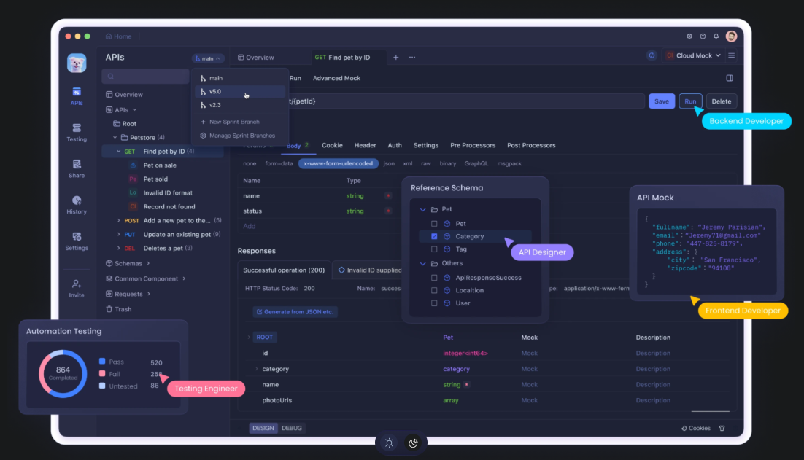

# Apidog

    

---

**Apidog** é uma ferramenta de gerenciamento de APIs que oferece uma plataforma visual e intuitiva para a criação, teste e documentação de APIs. Com o Apidog, os desenvolvedores podem desenhar e testar endpoints de APIs de maneira simplificada, sem a necessidade de escrever código manualmente. Ele combina funcionalidades de design de APIs, testes automatizados, documentação interativa e simulação de respostas, tudo em uma interface de fácil uso.

### Principais características do Apidog:
1. **Design Visual de APIs**: O Apidog permite que os desenvolvedores desenhem APIs de forma intuitiva, criando endpoints e definindo suas operações por meio de uma interface gráfica, sem a necessidade de codificação extensiva.

2. **Testes e Debugging**: A ferramenta permite testar as APIs de maneira rápida e fácil, simulando as requisições e verificando as respostas diretamente na interface, ajudando a identificar erros e melhorar a funcionalidade antes de colocar a API em produção.

3. **Documentação Automática**: O Apidog gera automaticamente documentação interativa para suas APIs, facilitando a compreensão e o uso por outros desenvolvedores ou equipes. A documentação é gerada com base nas definições e testes realizados na plataforma.

4. **Simulação de Respostas**: Você pode simular diferentes tipos de respostas da API com base nos dados definidos, permitindo testar o comportamento da API em condições variadas e sem a necessidade de um servidor real.

5. **Integração com outras Ferramentas**: O Apidog oferece integração com ferramentas populares de desenvolvimento e plataformas de CI/CD, permitindo que a equipe de desenvolvimento incorpore a ferramenta no seu fluxo de trabalho de forma eficaz.

6. **Colaboração em Equipe**: Permite que múltiplos membros de uma equipe colaborem na criação, testes e manutenção de APIs, facilitando a comunicação e a sincronização entre desenvolvedores, designers e outros stakeholders.

### Vantagens do Apidog:
- **Eficiência e Produtividade**: Ao automatizar o processo de testes e documentação, o Apidog permite que os desenvolvedores sejam mais produtivos e integrem mais rapidamente novas funcionalidades nas APIs.
- **Facilidade de Uso**: A interface visual torna o uso da ferramenta acessível até para desenvolvedores iniciantes, sem a necessidade de se aprofundar em configurações complexas.
- **Automação**: A automação de tarefas como testes, documentação e simulação de respostas ajuda a reduzir erros humanos e melhora a qualidade do código da API.

Em resumo, o Apidog é uma solução completa e fácil de usar para o gerenciamento e automação de APIs, oferecendo uma forma simplificada de criar, testar e documentar APIs com maior agilidade e menos esforço.

[Próximo passo... Instalação](install.md)
